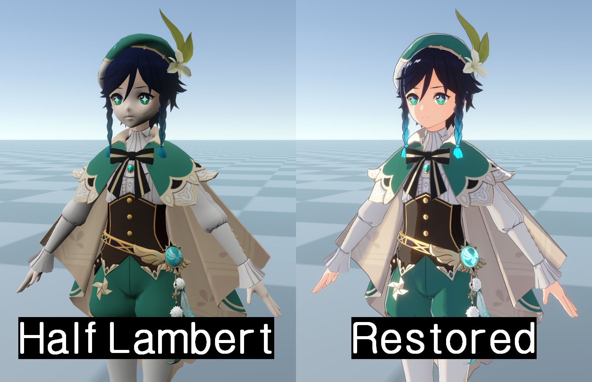

# Readme

* FaceLightmap should use an image where the R channel is copied, inverted, and then stored in the G channel instead of the original.

* Modify Shadow_Ramp so that the skin shadow color is positioned at the topmost part and 8px above the bottom.

# Preview

